# AsyncStandup 🚀

**AI-powered standup bot that detects when engineers are stuck through real-time voice analysis during daily standups.**

Engineers speak naturally into their microphone. AsyncStandup analyzes their responses using:
- **70% Conversational Analysis**: What they say (vagueness, hedging, help-seeking)
- **30% Emotional Signals**: How they sound (frustration, anxiety, confidence)

The system asks adaptive follow-up questions and provides real-time stuck probability scores.

## Live Mode Architecture

### System Block Diagram

```mermaid
graph TB
    User["👤 Engineer<br/>(Speaks into Mic)"]
    Browser["🌐 Browser<br/>(MediaRecorder API)"]
    Server["⚙️ FastAPI Server<br/>(Backend)"]
    GPT4["🤖 GPT-4<br/>(Analysis + Questions)"]
    Pulse["🎵 Smallest.ai Pulse<br/>(Transcription + Emotions)"]
    Storage["💾 Session Storage<br/>(History)"]
    
    User -->|"1. Speak Answer"| Browser
    Browser -->|"2. Upload Audio (WebM)"| Server
    Server -->|"3. Send for Analysis"| Pulse
    Pulse -->|"4. Transcript + Emotions"| Server
    Server -->|"5. Detect Stuck Signals"| GPT4
    GPT4 -->|"6. Vagueness, Hedging, etc."| Server
    Server -->|"7. Calculate Stuck Probability<br/>(70% conv + 30% emotion)"| Server
    Server -->|"8. Generate Next Question"| GPT4
    GPT4 -->|"9. Adaptive Question Text"| Server
    Server -->|"10. Store Session"| Storage
    Server -->|"11. Analysis + Next Question"| Browser
    Browser -->|"12. Display Analysis"| User
    
    style User fill:#e3f2fd
    style Browser fill:#fff3e0
    style Server fill:#f3e5f5
    style GPT4 fill:#e8f5e9
    style Pulse fill:#fce4ec
    style Storage fill:#f1f8e9
```



### Sequence Diagram - Live Standup Flow


## How It Works (Live Mode)

### Real-Time Pipeline

```
1. Engineer speaks into microphone (browser MediaRecorder)
   ↓
2. Auto-recorded audio sent to Smallest.ai Pulse API
   ↓
3. Pulse transcribes speech and detects emotions
   ↓
4. GPT-4 analyzes transcript for conversational stuck signals
   ↓
5. Calculate hybrid stuck probability (70% conv + 30% emotion)
   ↓
6. Display real-time analysis with adaptive next question
   ↓
7. After 5 exchanges, show final stuck probability progression
```

### Key Features
- ✅ **Zero-click conversation flow**: Auto-start recording, voice activity detection
- ✅ **Adaptive questioning**: System adjusts questions based on vagueness
- ✅ **Real-time analysis**: Immediate feedback after each response
- ✅ **Session history**: Review previous standups anytime
- ✅ **Privacy-focused**: Audio processed, not stored long-term

### Conversational Signals (70% weight)

Detected by GPT-4 analysis:
- **Vagueness**: Lack of specific details, abstract language
- **Hedging**: "um", "like", "I think", "kind of", "sort of"
- **Lack of specificity**: Concrete details vs vague statements
- **Avoiding help**: Not seeking help even when struggling
- **No progress indicators**: Unclear next steps

**Formula**:
```python
conversational_score = (
    vagueness * 0.3 +
    (1 - specificity) * 0.3 +
    (hedging / 20) * 0.2 +
    (0 if help_seeking else 1) * 0.2
)
```

### Emotional Signals (30% weight)

Detected by Smallest.ai Pulse API:
- Sadness, frustration, anxiety (higher = more stuck)
- Happiness, excitement (lower = more stuck)

**Formula**:
```python
emotional_score = (
    (sadness + frustration) * 0.4 +
    (1 - (happiness + excitement)) * 0.3 +
    anxiety * 0.3
)
```

### Stuck Probability

```python
stuck_probability = conversational_score * 0.7 + emotional_score * 0.3
```

**Thresholds**:
- `> 0.7`: 🚨 **STUCK** - Immediate intervention needed
- `0.4-0.7`: ⚠️ **WARNING** - Monitor closely
- `< 0.4`: ✅ **ON TRACK** - Healthy progress

## Why Voice Over Text?

AsyncStandup is fundamentally **voice-first**, not text-with-audio bolted on:

### Signals Only Voice Can Capture

**Emotional tone:**
- Frustration, sadness, anxiety in vocal patterns
- Energy levels (burnt out vs energized)
- Confidence vs uncertainty in delivery

**Hesitation patterns:**
- Pauses between words (thinking time)
- Filler words ("um", "uh", "like") frequency
- Speech rate (rushed vs careful)

**Authenticity:**
- Harder to fake enthusiasm in voice than text
- Natural expression reveals true state
- Lower cognitive load than writing polished updates

### Voice UX Advantages

**Lower friction:**
- Speak 150+ words/min vs type 40 words/min
- No need to craft "perfect" written status
- Captures nuance that typing loses

**Async-friendly:**
- Record standup anytime across timezones
- No scheduled meetings required
- AI analyzes overnight, flags issues by morning

**Natural for distributed teams:**
- Already using Slack voice messages
- Feels conversational, not bureaucratic
- Better engagement than text-only standups

### Quantified Impact

The emotional analysis (30% of stuck detection) would be **impossible with text alone**.
Even with sentiment analysis, text can't detect:
- Vocal fatigue patterns (burnout indicator)
- Hesitation from uncertainty (vs confident knowledge gaps)
- Frustrated tone (stuck) vs enthusiastic urgency (making progress)

**Voice isn't just convenient—it's essential for early stuck detection.**

## Live Demo Results

Example progression showing engineer becoming stuck over 5 exchanges:

| Exchange | Status | Stuck Prob | Vagueness | Hedging | Help-Seeking |
|----------|--------|-----------|-----------|---------|-------------|
| 1 | ✅ ON TRACK | 28% | 30% | 5 | Yes |
| 2 | ✅ ON TRACK | 35% | 40% | 8 | Yes |
| 3 | ⚠️ WARNING | 48% | 55% | 12 | No |
| 4 | ⚠️ WARNING | 62% | 70% | 15 | No |
| 5 | 🚨 STUCK | 73% | 85% | 20 | No |

**Analysis**: Clear progression from healthy (28%) to stuck (73%). Conversational signals (vagueness, hedging) increased while help-seeking disappeared.

### Testing Modes

For development and testing, AsyncStandup includes:
- **Demo Mode**: Pre-generated AI personas (Steve, Sarah, Marcus, Priya, Alex) for presentation demos
- **AI Persona Runner**: Automated AI-vs-AI conversations for testing detection algorithms

These modes validate the hybrid detection approach but are **not the primary product**. The main use case is **Live Mode with real engineers**.

## Installation

### Prerequisites
- Python 3.11+
- [uv](https://github.com/astral-sh/uv) package manager
- OpenAI API key (for GPT-4 and TTS)
- Smallest.ai Pulse API key (for emotion detection)

### Setup

```bash
# Clone repository
git clone <repository-url>
cd async_standup

# Install dependencies with uv
uv sync

# Configure environment variables
cp .env.example .env
# Edit .env and add your API keys:
# OPENAI_API_KEY=sk-...
# SMALLEST_API_KEY=... (or PULSE_API_KEY=...)
```

## Usage

### Run Live Interactive Mode (Primary Use Case)

```bash
# Start the voice demo server
uv run python voice_demo_server.py

# Open browser to http://localhost:8000
# Click "Live Mode" → "Record Your Standup"
# Grant microphone permission and start speaking
```

**Live Mode Flow**:
1. AI asks first question (auto-plays)
2. You speak your answer (auto-records)
3. System detects silence and auto-stops
4. Real-time analysis displays:
   - Transcript with confidence
   - Emotions detected
   - Speech patterns
   - Conversational signals
5. AI asks adaptive follow-up question
6. Repeat for 5 exchanges
7. View final stuck probability progression
8. Session saved to history

### Testing Modes (Development Only)

#### Demo Mode
Pre-generated AI persona conversations for presentations:
```bash
# In browser: Select "Demo Mode" → Choose persona → Generate
# Personas: Steve (stuck), Sarah (overwhelmed), Marcus (overconfident), Priya (healthy), Alex (burnt out)
```

#### AI Persona Runner
Automated AI-vs-AI testing:
```bash
# In browser: "Live Mode" → "Run AI Persona" tab → Select persona → Start
# Validates detection algorithms without human input
```

#### Hybrid Demo (Command Line)
Full pipeline test:
```bash
uv run python hybrid_demo.py
```

### Run Tests

```bash
uv run pytest tests/ -v
```

Current test coverage:
- Storage module: 10 tests ✅
- Audio generation: 8 tests ✅
- Pulse API integration: 8 tests ✅
- Insight engine: 17 tests ✅
- Integration tests: 5 tests ✅

**Total**: 52 tests passing

## Project Structure

```
async_standup/
├── src/async_standup/
│   ├── storage.py              # JSON data storage
│   ├── generate_audio.py       # OpenAI TTS integration
│   ├── analyze_audio.py        # Pulse API integration
│   ├── conversation_agent.py   # GPT-4 conversation generation & analysis
│   └── insight_engine.py       # Hybrid stuck detection logic
├── tests/                      # Unit and integration tests
├── hybrid_demo.py              # Full pipeline demo
├── generate_conversation_audio.py  # Audio generation from conversations
├── demo.py                     # Original emotion-only demo
└── data/                       # Generated audio and results
```

## API Keys

### Smallest.ai API (Required)
- **Pulse API**: Audio transcription + emotion detection
  - Endpoint: `https://waves-api.smallest.ai/api/v1/pulse/get_text`
- **Lightning API**: AI interviewer questions (TTS)
  - Endpoint: `https://waves-api.smallest.ai/api/v1/lightning/get_speech`
- **Get key**: Contact Smallest.ai
- **Environment**: `SMALLEST_API_KEY=...` or `PULSE_API_KEY=...`

### OpenAI API (Required)
- **Purpose**: GPT-4 conversation analysis and adaptive questioning
- **Models**: `gpt-4o` (analysis), `gpt-4o-mini-tts` (testing mode only)
- **Get key**: https://platform.openai.com/api-keys
- **Environment**: `OPENAI_API_KEY=sk-...`

**Note**: OpenAI TTS is only used for AI Persona testing modes. Live Mode uses Smallest.ai Lightning for interviewer questions and no TTS for the user's voice (direct microphone input).

## Configuration

### Environment Variables

```bash
# Required
OPENAI_API_KEY=sk-...          # OpenAI API key
SMALLEST_API_KEY=...           # Smallest.ai Pulse API key (or PULSE_API_KEY)

# Optional
SLACK_WEBHOOK_URL=...          # For Slack notifications (future feature)
```

## Technical Details

### Data Schema

Each standup entry contains:
```json
{
  "id": 1,
  "date": "2026-02-14",
  "day_number": 1,
  "conversation": [{"q": "...", "a": "..."}],
  "transcript": "Full conversation text",
  "emotion_score": 65.0,
  "dominant_emotion": "happiness",
  "emotions": {"happiness": 0.65, "sadness": 0.20, ...},
  "conversational_signals": {
    "vagueness_score": 0.2,
    "hedging_count": 5,
    "specificity_score": 0.8,
    "help_seeking": true,
    "progress_indicators": true
  },
  "stuck_probability": 0.28,
  "stuck_status": "on_track",
  "created_at": "2026-02-14T10:00:00Z"
}
```

### Conversational Analysis

GPT-4 analyzes conversations using:
- System prompt defining stuck patterns
- Multi-turn Q&A context
- Structured JSON output with scores

### Emotion Detection

Pulse API provides:
- Transcription accuracy
- 6+ emotion categories
- Confidence scores per emotion

## Development

### Adding New Signals

1. **Conversational**: Update `conversation_agent.py` analyzer prompt
2. **Emotional**: Pulse API provides emotions automatically
3. **Hybrid**: Adjust weights in `insight_engine.py::calculate_stuck_probability()`

### Running Individual Components

```bash
# Test storage
uv run python -m src.async_standup.storage

# Generate audio
uv run python -m src.async_standup.generate_audio

# Analyze audio
uv run python -m src.async_standup.analyze_audio <audio_file>

# Generate conversations
uv run python -m src.async_standup.conversation_agent
```

## Future Enhancements

- [ ] Real-time Slack bot integration (async standup via DM)
- [ ] Historical trend analysis (stuck patterns over weeks)
- [ ] Team-level aggregation (team health dashboard)
- [ ] Custom signal weighting per team culture
- [ ] Integration with Jira/Linear for task context
- [ ] Multi-language support (non-English standups)
- [ ] Mobile app for voice capture
- [ ] Manager intervention recommendations

## Contributing

Contributions welcome! Please:
1. Add tests for new features
2. Update documentation
3. Follow existing code style
4. Run tests before submitting PR

## License

MIT

## Acknowledgments

- **OpenAI**: GPT-4 and TTS models
- **Smallest.ai**: Pulse API for emotion detection
- **uv**: Fast Python package manager

---

**Note**: This project was built with significant AI assistance. See AGENTS.md for development notes.