# AsyncStandup 🚀

**AI-powered standup bot that detects when engineers are stuck through hybrid conversational and emotional analysis.**

## Live Mode Architecture

### System Block Diagram

```mermaid
graph TB
    User["👤 Engineer<br/>(Voice Input)"]
    Browser["🌐 Browser<br/>(MediaRecorder API)"]
    Server["⚙️ FastAPI Server<br/>(Backend)"]
    GPT4["🤖 GPT-4<br/>(Analysis + Questions)"]
    TTS["🔊 OpenAI TTS<br/>(Audio Generation)"]
    Pulse["🎵 Smallest.ai Pulse<br/>(Transcription + Emotions)"]
    Storage["💾 Session Storage<br/>(History)"]
    
    User -->|"1. Speak Answer"| Browser
    Browser -->|"2. Upload Audio"| Server
    Server -->|"3. Analyze Audio"| Pulse
    Pulse -->|"4. Transcript + Emotions"| Server
    Server -->|"5. Detect Stuck Signals"| GPT4
    GPT4 -->|"6. Vagueness, Hedging, etc."| Server
    Server -->|"7. Generate Next Question"| GPT4
    GPT4 -->|"8. Question Text"| Server
    Server -->|"9. Convert to Speech"| TTS
    TTS -->|"10. Audio File"| Server
    Server -->|"11. Store Session"| Storage
    Server -->|"12. Analysis + Question"| Browser
    Browser -->|"13. Display + Play"| User
    
    style User fill:#e3f2fd
    style Browser fill:#fff3e0
    style Server fill:#f3e5f5
    style GPT4 fill:#e8f5e9
    style TTS fill:#c8e6c9
    style Pulse fill:#fce4ec
    style Storage fill:#f1f8e9
```



### Sequence Diagram - Live Standup Flow

```mermaid
sequenceDiagram
    participant Engineer
    participant Browser
    participant Server
    participant Pulse
    participant GPT4
    
    Note over Engineer,Server: 1. Start Session
    Engineer->>Browser: Click "Start My Standup"
    Browser->>Server: POST /api/interactive/start
    Server->>GPT4: Generate first question
    GPT4-->>Server: "What did you work on yesterday?"
    Server->>Server: Convert to audio (TTS)
    Server-->>Browser: {question_text, audio_url}
    Browser->>Engineer: 🔊 Play question
    
    Note over Engineer,Browser: 2. Engineer Responds
    Engineer->>Browser: 🎤 Speak answer
    Browser->>Browser: Auto-record via MediaRecorder
    Browser->>Browser: Detect 2s silence (VAD)
    Browser->>Browser: Auto-stop recording
    
    Note over Browser,GPT4: 3. Analyze Response
    Browser->>Server: POST /api/interactive/record<br/>{audio_file, session_id}
    Server->>Pulse: Transcribe + detect emotions
    Pulse-->>Server: {transcript, emotions, confidence}
    
    Server->>GPT4: Analyze conversation signals
    GPT4-->>Server: {vagueness: 0.7,<br/>hedging_count: 12,<br/>help_seeking: false}
    
    Server->>Server: Calculate stuck probability<br/>= (0.7 * conv_score) + (0.3 * emotion_score)
    
    Note over Server,GPT4: 4. Generate Next Question
    alt Vagueness > 0.5
        Server->>GPT4: "Can you be more specific?"
    else Vagueness <= 0.5
        Server->>GPT4: "What are you working on today?"
    end
    GPT4-->>Server: Adaptive question text
    Server->>Server: Convert to audio (TTS)
    
    Server-->>Browser: {analysis, stuck_probability,<br/>next_question, audio_url}
    Browser->>Engineer: 📊 Display: Vagueness 70%, Hedging 12<br/>📈 Stuck probability: 58%
    Browser->>Engineer: 🔊 Play next question
    
    Note over Engineer,Server: 5. Repeat for 5 exchanges
    
    Note over Browser,Server: 6. Complete Session
    Browser->>Server: POST /api/interactive/save
    Server->>Server: Generate final chart
    Server-->>Browser: Session saved ✅
    Browser->>Engineer: 📈 Show stuck probability progression<br/>Exchange 1: 28% → Exchange 5: 73%
```



## Core Insight

Instead of relying solely on emotion detection, AsyncStandup combines:
- **70% Conversational Analysis**: What engineers say and how they respond to follow-up questions
- **30% Emotional Signals**: How they sound when speaking

Vague answers + repeated tasks + avoiding detail + declining emotion = stuck, regardless of tone alone.

## How It Works

### Pipeline

```
1. GPT-4 generates realistic conversations (or uses real standup data)
   ↓
2. OpenAI TTS converts to audio with emotional instructions
   ↓
3. Smallest.ai Pulse API transcribes audio and extracts emotions
   ↓
4. GPT-4 analyzes conversations for stuck signals
   ↓
5. Calculate hybrid stuck probability (70% conv + 30% emotion)
   ↓
6. Display results with intervention recommendations
```

### Conversational Signals (70% weight)

Detected by GPT-4 analysis:
- **Vagueness**: Lack of specific details, abstract language
- **Hedging**: "um", "like", "I think", "kind of", "sort of"
- **Lack of specificity**: Concrete details vs vague statements
- **Avoiding help**: Not seeking help even when struggling
- **No progress indicators**: Unclear next steps

**Formula**:
```python
conversational_score = (
    vagueness * 0.3 +
    (1 - specificity) * 0.3 +
    (hedging / 20) * 0.2 +
    (0 if help_seeking else 1) * 0.2
)
```

### Emotional Signals (30% weight)

Detected by Smallest.ai Pulse API:
- Sadness, frustration, anxiety (higher = more stuck)
- Happiness, excitement (lower = more stuck)

**Formula**:
```python
emotional_score = (
    (sadness + frustration) * 0.4 +
    (1 - (happiness + excitement)) * 0.3 +
    anxiety * 0.3
)
```

### Stuck Probability

```python
stuck_probability = conversational_score * 0.7 + emotional_score * 0.3
```

**Thresholds**:
- `> 0.7`: 🚨 **STUCK** - Immediate intervention needed
- `0.4-0.7`: ⚠️ **WARNING** - Monitor closely
- `< 0.4`: ✅ **ON TRACK** - Healthy progress

## Demo Results

Real output from the hybrid demo showing progression from healthy → stuck:

| Day | Status | Stuck Prob | Vagueness | Hedging | Emotion |
|-----|--------|-----------|-----------|---------|----------|
| 1 | ✅ ON TRACK | 27.9% | 10% | 5 | happiness 36.5% |
| 2 | ✅ ON TRACK | 27.9% | 10% | 5 | happiness 33.8% |
| 3 | ⚠️ WARNING | 41.9% | 40% | 9 | happiness 21.3% |
| 4 | ⚠️ WARNING | 67.1% | 80% | 15 | happiness 8.3% |
| 5 | 🚨 STUCK | 72.7% | 90% | 23 | happiness 14.7% |

**Analysis**: Clear progression from on_track (28%) to stuck (73%). Conversational signals (vagueness, hedging) increased dramatically while emotions declined.

## Installation

### Prerequisites
- Python 3.11+
- [uv](https://github.com/astral-sh/uv) package manager
- OpenAI API key (for GPT-4 and TTS)
- Smallest.ai Pulse API key (for emotion detection)

### Setup

```bash
# Clone repository
git clone <repository-url>
cd async_standup

# Install dependencies with uv
uv sync

# Configure environment variables
cp .env.example .env
# Edit .env and add your API keys:
# OPENAI_API_KEY=sk-...
# SMALLEST_API_KEY=... (or PULSE_API_KEY=...)
```

## Usage

### Run Full Hybrid Demo

```bash
uv run python hybrid_demo.py
```

This will:
1. Generate 5 days of realistic conversations
2. Convert to audio with emotional TTS
3. Analyze with Pulse API for emotions
4. Analyze with GPT-4 for conversational signals
5. Calculate hybrid stuck probability
6. Display detailed results and recommendations

**Output**:
- Audio files: `data/hybrid_demo/audio/`
- JSON data: `data/hybrid_demo/hybrid_standups.json`

### Generate Conversations Only

```bash
uv run python -m src.async_standup.conversation_agent
```

### Generate Audio from Conversations

```bash
uv run python generate_conversation_audio.py
```

### Run Tests

```bash
uv run pytest tests/ -v
```

Current test coverage:
- Storage module: 10 tests ✅
- Audio generation: 8 tests ✅
- Pulse API integration: 8 tests ✅
- Insight engine: 17 tests ✅
- Integration tests: 5 tests ✅

**Total**: 52 tests passing

## Project Structure

```
async_standup/
├── src/async_standup/
│   ├── storage.py              # JSON data storage
│   ├── generate_audio.py       # OpenAI TTS integration
│   ├── analyze_audio.py        # Pulse API integration
│   ├── conversation_agent.py   # GPT-4 conversation generation & analysis
│   └── insight_engine.py       # Hybrid stuck detection logic
├── tests/                      # Unit and integration tests
├── hybrid_demo.py              # Full pipeline demo
├── generate_conversation_audio.py  # Audio generation from conversations
├── demo.py                     # Original emotion-only demo
└── data/                       # Generated audio and results
```

## API Keys

### OpenAI API
- **Purpose**: GPT-4 (conversations), TTS (audio generation)
- **Models**: `gpt-4o`, `gpt-4o-mini-tts`
- **Get key**: https://platform.openai.com/api-keys

### Smallest.ai Pulse API
- **Purpose**: Audio transcription + emotion detection
- **Endpoint**: `https://waves-api.smallest.ai/api/v1/pulse/get_text`
- **Get key**: Contact Smallest.ai

## Configuration

### Environment Variables

```bash
# Required
OPENAI_API_KEY=sk-...          # OpenAI API key
SMALLEST_API_KEY=...           # Smallest.ai Pulse API key (or PULSE_API_KEY)

# Optional
SLACK_WEBHOOK_URL=...          # For Slack notifications (future feature)
```

## Technical Details

### Data Schema

Each standup entry contains:
```json
{
  "id": 1,
  "date": "2026-02-14",
  "day_number": 1,
  "conversation": [{"q": "...", "a": "..."}],
  "transcript": "Full conversation text",
  "emotion_score": 65.0,
  "dominant_emotion": "happiness",
  "emotions": {"happiness": 0.65, "sadness": 0.20, ...},
  "conversational_signals": {
    "vagueness_score": 0.2,
    "hedging_count": 5,
    "specificity_score": 0.8,
    "help_seeking": true,
    "progress_indicators": true
  },
  "stuck_probability": 0.28,
  "stuck_status": "on_track",
  "created_at": "2026-02-14T10:00:00Z"
}
```

### Conversational Analysis

GPT-4 analyzes conversations using:
- System prompt defining stuck patterns
- Multi-turn Q&A context
- Structured JSON output with scores

### Emotion Detection

Pulse API provides:
- Transcription accuracy
- 6+ emotion categories
- Confidence scores per emotion

## Development

### Adding New Signals

1. **Conversational**: Update `conversation_agent.py` analyzer prompt
2. **Emotional**: Pulse API provides emotions automatically
3. **Hybrid**: Adjust weights in `insight_engine.py::calculate_stuck_probability()`

### Running Individual Components

```bash
# Test storage
uv run python -m src.async_standup.storage

# Generate audio
uv run python -m src.async_standup.generate_audio

# Analyze audio
uv run python -m src.async_standup.analyze_audio <audio_file>

# Generate conversations
uv run python -m src.async_standup.conversation_agent
```

## Future Enhancements

- [ ] Real-time Slack integration
- [ ] Historical trend analysis
- [ ] Team-level aggregation
- [ ] Custom signal weighting per team
- [ ] Integration with Jira/Linear for task context
- [ ] Multi-language support
- [ ] Voice-based standup capture

## Contributing

Contributions welcome! Please:
1. Add tests for new features
2. Update documentation
3. Follow existing code style
4. Run tests before submitting PR

## License

MIT

## Acknowledgments

- **OpenAI**: GPT-4 and TTS models
- **Smallest.ai**: Pulse API for emotion detection
- **uv**: Fast Python package manager

---

**Note**: This project was built with significant AI assistance. See AGENTS.md for development notes.